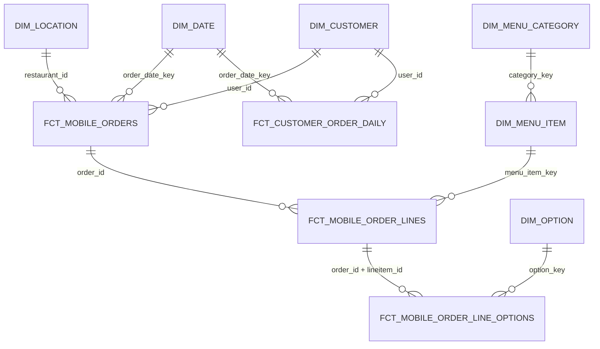

# Question 2 Answer

## 1. Data Profiling, Quality Issues, and Reporting Readiness

I profiled `order_items.csv` and `order_item_options.csv` as transaction data from Alltown Fresh mobile ordering. The data is useful, but it is not immediately reporting-ready. The main work is not complicated math; it is protecting grain, scope, identity, product taxonomy, and revenue calculations before analysts build KPIs.

### Profile Highlights

| Area | Finding |
|---|---:|
| Order item rows | 203,519 |
| Option/modifier rows | 193,017 |
| Distinct orders | 131,328 |
| Distinct line items | 203,519 |
| Duplicate line item IDs | 0 |
| In-scope Alltown Fresh line items | 201,423 |
| In-scope Alltown Fresh orders | 129,511 |
| Date range | 2020-04-21 to 2024-02-21 |
| Currency | USD only |
| Loyalty rows | 46,084 |
| Non-loyalty rows | 157,435 |
| Distinct `user_id` values | 20,174 |
| Distinct printed card values | 5,866 |

### Key Data Quality Issues

1. Source scope needs to be enforced.

   The data includes `Alltown Fresh`, `Alltown Neighborhood Perks`, and `Alltown Fresh - DEVELOPMENT`. Since the prompt scopes the analysis to Alltown Fresh mobile ordering, reporting models should filter to production `Alltown Fresh` records while preserving all rows in raw/staging.

2. Customer identity is nuanced.

   `user_id` is not the same thing as loyalty membership. There are 139,655 non-loyalty rows with populated `user_id`, 17,808 rows with null `user_id`, and 28 loyalty rows with null `user_id`. Customer marts should use non-null `user_id`, loyalty marts should require `is_loyalty = true`, and guest/null-user transactions should remain available for order/item reporting but excluded from customer-level metrics.

3. `printed_card_number` is too sparse to be the customer key.

   77.36% of line-item rows have null `printed_card_number`. It should be treated as an optional loyalty attribute, not the primary customer identifier.

4. Options require strict grain handling.

   Options are keyed by `order_id + lineitem_id`. There are 28 orphan option rows without a matching line item. Options should be modeled either as their own fact table or pre-aggregated to line-item grain before joining.

5. Product categories need cleanup.

   There are corrupted and inconsistent category values such as `BBQ Plateshttps://...`, `Drip Chttps://...offee`, `Bowls0`, `Sandwiches\`1`, `Sqalads`, plus both `Kids` and `Kid's`. Category reporting needs a canonical mapping table and a higher-level reporting rollup.

6. Item names need normalization.

   55,221 item names end with `*`, which appears to be a menu marker rather than part of the product name. I would preserve raw item names and create a normalized display name after confirming the marker's business meaning.

7. Price and quantity outliers need flags.

   There are no negative prices or quantities, but there are extreme values: max item price is $5,000, max quantity is 500, and the largest Alltown Fresh order total is $2,500,000. These should be flagged and reviewed before executive sales reporting. I would not silently delete them.

8. Zero-price items need business classification.

   There are 156 item rows with `item_price = 0`. They may represent comps, promotions, redemptions, bad menu setup, or discounts not separately modeled. Keep them, flag them, and classify once business rules are known.

9. Timestamp formats are mixed but valid.

   203,332 timestamps include fractional seconds and 187 are whole-second ISO timestamps. A robust parser handles both. The staging layer should use a tolerant timestamp parse and test for null parsed timestamps.

### Staging-Layer Treatment

In staging, I would:

- Rename source columns to lower snake case.
- Cast timestamps, booleans, amounts, and quantities.
- Preserve raw values alongside cleaned values where cleanup is nontrivial.
- Add `is_in_scope_alltown_fresh`.
- Add `is_valid_line_item`.
- Add `is_guest_order` and `has_customer_id`.
- Add price/quantity/outlier flags.
- Standardize item category through a mapping table.
- Normalize item names separately from raw item names.
- Quarantine orphan options and malformed line items in data quality exception models.
- Add tests for grain, relationships, accepted values, parsed timestamps, and nonnegative amounts.

The detailed profile and staging recommendations are in `analysis/q2_data_quality_and_staging.md`.

## 2. Proposed Dimensional / dbt Mart Model

I would build a star schema with explicit transaction grains and curated marts for common stakeholder workflows.

### Fact Tables

| Model | Grain | Purpose |
|---|---|---|
| `fct_mobile_orders` | One row per `order_id` | Order count, AOV, sales, loyalty order mix, location/daypart trends |
| `fct_mobile_order_lines` | One row per `order_id + lineitem_id` | Item/category performance, units, item revenue, product mix |
| `fct_mobile_order_line_options` | One row per selected option | Modifier attach rates, customization, option revenue |
| `fct_customer_order_daily` | One row per `user_id + order_date` | Visit frequency, retention, repeat behavior, customer trends |

### Dimension Tables

| Model | Grain | Purpose |
|---|---|---|
| `dim_customer` | One row per `user_id` | Customer identity, loyalty attributes, first/last order dates |
| `dim_location` | One row per `restaurant_id` | Location/store reporting; later enrich with region/market/store type |
| `dim_menu_item` | One row per normalized menu item | Product reporting and item normalization |
| `dim_menu_category` | One row per canonical category | Category cleanup and reporting rollups |
| `dim_option` | One row per normalized option group/name | Modifier analytics |
| `dim_date` | One row per date | Fiscal calendar, holiday flags, day/week/month rollups |
| `dim_time` or daypart mapping | One row per time bucket/daypart | Breakfast/lunch/afternoon/evening analysis |

### Mart Tables

| Model | Grain | Purpose |
|---|---|---|
| `mart_loyalty_customer_metrics` | One row per loyalty `user_id` | Lifetime value, recency, frequency, top category, loyalty segmentation |
| `mart_location_daily_mobile_ordering` | One row per `restaurant_id + order_date` | Store performance, demand patterns, staffing/operations support |
| `mart_menu_item_performance_daily` | One row per `menu_item + order_date` | Menu performance, item/category trends, product decisions |
| `mart_customer_monthly_metrics` | One row per `user_id + month` | Retention, cohort, and engagement trends |

### ERD Sketch

The full model write-up is in `models/q2_dimensional_model.md`.

Representative dbt SQL skeletons and model documentation/tests are included under `models/facts`, `models/dimensions`, `models/marts`, and `models/schema.yml`.

## 3. Business Questions Enabled by the Model

### 1. How is Alltown Fresh mobile ordering performing by location and time?

Supported by:

- `fct_mobile_orders`
- `mart_location_daily_mobile_ordering`
- `dim_location`
- `dim_date`
- daypart mapping

Metrics:

- Orders
- Gross sales
- Average order value
- Items per order
- Loyalty order share
- Daypart mix
- Week-over-week or month-over-month growth

### 2. Which menu categories and items are driving sales and unit volume?

Supported by:

- `fct_mobile_order_lines`
- `dim_menu_item`
- `dim_menu_category`
- `mart_menu_item_performance_daily`

Metrics:

- Units sold
- Item sales
- Category sales
- Share of sales
- Share of units
- Average item price
- Category mix by location and daypart

### 3. How do loyalty customers behave differently from non-loyalty or guest customers?

Supported by:

- `fct_mobile_orders`
- `fct_customer_order_daily`
- `dim_customer`
- `mart_loyalty_customer_metrics`

Metrics:

- Loyalty order share
- Loyalty sales share
- Average order value by loyalty flag
- Orders per customer
- Repeat purchase rate
- Recency and frequency segments
- Lifetime spend

### 4. What modifiers/options are most commonly attached, and do they increase basket value?

Supported by:

- `fct_mobile_order_line_options`
- `fct_mobile_order_lines`
- `dim_option`
- `dim_menu_item`
- `dim_menu_category`

Metrics:

- Option attach rate
- Average modifier revenue per line
- Modifier revenue share
- Most common option groups by item
- Basket value with versus without modifiers

### 5. Are there data quality or operational anomalies that should be investigated?

Supported by:

- Staging exception models
- `fct_mobile_orders`
- `fct_mobile_order_lines`
- `mart_location_daily_mobile_ordering`

Metrics:

- Count of orphan option rows
- Count of malformed line items
- Zero-price item count
- High-value/high-quantity order count
- Unknown category share
- Orders excluded from curated reporting
- Data quality issue rate by source app, location, and date

## Recommended Next Steps

1. Implement staging and intermediate models first, with tests around grain and referential integrity.
2. Build the core facts: orders, order lines, and order line options.
3. Create category and item normalization reference tables.
4. Build the customer, location, menu item, category, option, and date dimensions.
5. Publish curated marts only after data quality exception logic is explicit and documented.
